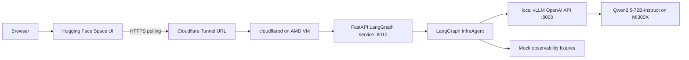

# InfraAgent Architecture

Research date: 2026-05-09, Europe/Minsk.

## Summary
InfraAgent is now positioned as **InfraAgent ReplayOps**, a bounded LangGraph incident-triage system for the AMD Developer Hackathon. It receives an alert from a Hugging Face Spaces UI, investigates synthetic observability data with mock tools, identifies a likely root cause, returns a recovery runbook, and emits judge-visible proof: evidence timeline, node trace, runtime proof, deterministic eval scorecard, and War Room Packet.

The selected pattern is a deterministic pipeline with a verification gate:

Alert Ingestor -> Investigator -> Root Cause Analyst -> Runbook Generator -> Verification Gate.

This is not a simple RAG system. The system does not only search documents. It executes a multi-step incident workflow, calls typed observability tools, compares evidence across metrics/logs/deploy events/traces/topology, produces hypotheses, rejects weak causes, and emits a runbook with validation checks.

## Source Basis
Confirmed official LangGraph patterns:
- LangGraph is designed for long-running, stateful agent orchestration with durable execution, streaming, human-in-the-loop, and persistence: https://docs.langchain.com/oss/python/langgraph/overview
- `StateGraph`, `MessagesState`, `START`, and `END` are the core graph primitives used in the official Python examples: https://docs.langchain.com/oss/python/langgraph/overview
- `MessagesState` is the prebuilt message state, and can be subclassed with additional fields: https://docs.langchain.com/oss/python/langgraph/graph-api
- Edges control routing, conditional edges select the next node from state, and each node should use one routing mechanism for clarity: https://docs.langchain.com/oss/python/langgraph/graph-api
- LangGraph supports checkpoints and state snapshots for fault-tolerant execution and status inspection: https://docs.langchain.com/oss/python/langgraph/persistence
- `recursion_limit`, `langgraph_step`, and `RemainingSteps` support bounded execution and graceful loop handling: https://docs.langchain.com/oss/python/langgraph/graph-api

Infrastructure basis from `docs/research-report.md`:
- vLLM and LangGraph run on the AMD Developer Cloud VM beside Qwen2.5-72B-Instruct.
- Hugging Face Spaces hosts only the UI.
- The public path is Cloudflare Tunnel to FastAPI.
- External UI uses polling, not SSE or WebSocket.
- Expose LangGraph/FastAPI, not raw vLLM.

## Deployment Topology


## LangGraph Pattern
Chosen pattern: bounded sequential pipeline with a verification gate.

Why this pattern:
- Incident triage naturally flows from alert -> evidence -> cause -> recovery.
- The graph is predictable enough for a 1-2 minute demo.
- It still demonstrates sophisticated agentic behavior because the Investigator uses tools and the Verification Gate can request one additional evidence round.
- It avoids the overhead of a general Supervisor that would spend time deciding among many workers.

Rejected pattern: broad Supervisor + Workers.

Reason for rejection: it creates more routing uncertainty and higher latency without improving the demo. A general supervisor is useful when task order is unknown; here the triage order is known.

## State Schema
The implementation should define a state type that extends `MessagesState` and adds explicit incident, evidence, analysis, runbook, and audit fields.

State fields:

| Field | Type | Owner | Purpose |
|---|---|---|---|
| `run_id` | string | API | Stable ID returned to UI |
| `status` | enum | Graph | `queued`, `running`, `needs_more_evidence`, `ready`, `needs_human_review`, `failed` |
| `current_node` | string | Graph | Node currently executing or last completed |
| `messages` | list | All nodes | LangGraph-compatible message history and concise agent updates |
| `ui_events` | list of event objects | All nodes | Append-only progress events for polling |
| `incident_context` | object | Alert Ingestor | Normalized alert, service, environment, severity, time window |
| `evidence` | object | Investigator | Tool results grouped by metrics, logs, deploy events, traces, topology, templates, and errors |
| `hypotheses` | list | Root Cause Analyst | Ranked possible causes with confidence and evidence IDs |
| `root_cause` | object or null | Root Cause Analyst | Selected cause, confidence, supporting evidence, rejected alternatives, gaps |
| `runbook` | object or null | Runbook Generator | Recovery plan, validation, rollback, communication summary |
| `control` | object | Verification Gate | Step counters, node visits, investigation rounds, max steps, approval flags |
| `runtime_proof` | object | Alert Ingestor | vLLM/Qwen health, model ID, latency, backend mode |
| `evidence_items` | list | Investigator | Flattened evidence timeline for UI |
| `eval_scorecard` | object or null | Verification Gate | Deterministic quality score for evidence, citations, and runbook |
| `war_room_packet` | string or null | Verification Gate | Markdown incident packet with audit seal |
| `node_traces` | list | All nodes | Per-node duration, decision, observations, and tool calls |
| `audit` | object | All nodes | Trace ID, model config label, tool calls, latency, timestamps |
| `errors` | list | All nodes | Structured recoverable errors |

Recommended `control` fields:
- `step_count`: incremented by every node.
- `max_steps`: default 7.
- `investigation_round`: starts at 1, maximum 2.
- `node_visits`: map of node name to visit count.
- `recursion_limit`: runtime config value, recommended 8.
- `approval`: `approved`, `needs_more_evidence`, `human_review`, or `failed`.

## Nodes
### 1. Alert Ingestor
Role: normalize the incoming alert into a clean incident context and collect runtime proof from the local vLLM/Qwen endpoint.

Inputs:
- Raw alert from `POST /api/triage`.
- Optional scenario ID for deterministic demo fixture selection.

Responsibilities:
- Validate required alert fields.
- Normalize service, environment, severity, timestamp, and time window.
- Create the first UI event.
- Initialize control state and audit trace.
- Probe `VLLM_BASE_URL` `/models` endpoint and mark the run as `live_vllm`, `runtime_unhealthy`, or `fallback_without_live_vllm`.

Outputs:
- `incident_context`
- `status = running`
- `current_node = alert_ingestor`
- first `ui_events` item

Failure behavior:
- If alert is malformed, set `status = failed` with a validation error.

### 2. Investigator
Role: collect and summarize observability evidence.

Inputs:
- `incident_context`
- existing `evidence`
- missing evidence requests from the Verification Gate, if any.

Tools:
- `fetch_prometheus_metrics_mock`
- `query_elasticsearch_mock`
- `fetch_deploy_events_mock`
- `query_trace_spans_mock`
- `fetch_service_topology_mock`

Responsibilities:
- Call the relevant mock tools.
- Identify anomalies, not final conclusions.
- Store raw-ish evidence summaries with evidence IDs.
- Record tool calls in audit state.

Outputs:
- `evidence`
- concise investigation summary in `messages`
- progress events for each tool group

Failure behavior:
- Tool read failures are added to `evidence.tool_errors`; the graph can continue if enough evidence remains.

### 3. Root Cause Analyst
Role: reason over evidence and rank candidate causes.

Inputs:
- `incident_context`
- `evidence`

Responsibilities:
- Compare metrics, logs, deploy events, traces, and topology.
- Produce 2-4 hypotheses.
- Select one likely root cause only if evidence is sufficient.
- Explicitly list rejected causes and why they were weaker.
- Assign confidence as `low`, `medium`, or `high`.
- Ask Qwen for a short critic note when live vLLM is reachable; skip honestly when not reachable.

Outputs:
- `hypotheses`
- `root_cause`
- analysis event for UI

Failure behavior:
- If evidence is too weak, set `root_cause.confidence = low` and include `root_cause.gaps`.

### 4. Runbook Generator
Role: convert the selected cause into an operator-facing recovery plan.

Inputs:
- `incident_context`
- `root_cause`
- `evidence`

Tools:
- `read_runbook_template_mock`

Responsibilities:
- Generate a short recovery plan for the demo.
- Include immediate mitigation, validation checks, rollback option, owner notes, and communication summary.
- Mark destructive or risky actions as recommendations requiring human approval.

Outputs:
- `runbook`
- runbook event for UI

Failure behavior:
- If no credible root cause exists, generate a partial runbook focused on safe diagnostics and mark `needs_human_review`.

### 5. Verification Gate
Role: enforce quality, loop bounds, evaluation, War Room Packet export, and final status.

Inputs:
- all state fields.

Responsibilities:
- Check that incident context, evidence, root cause, and runbook are present.
- Check that the root cause cites evidence IDs.
- Check that the runbook has validation steps and does not claim unsafe auto-remediation.
- Calculate deterministic eval score for expected evidence, cited evidence, root-cause match, and runbook completeness.
- Generate a War Room Packet with an audit seal.
- Decide whether to finish, request one more Investigator round, or end with human review.
- Enforce `max_steps`, `node_visits`, and `investigation_round` limits.

Outputs:
- `status = ready`, `needs_human_review`, or `failed`
- final UI event
- optional `missing_evidence_requests`
- `eval_scorecard`
- `war_room_packet`

Failure behavior:
- If loop bounds are reached, return partial best-effort output and set `needs_human_review`.

## Mock Tools
Mock tools are deterministic local tool calls. They should be implemented as normal LangGraph/LangChain tools or plain function calls wrapped at the Investigator node. They do not call live production systems.

| Tool | Input | Output | Mock data needed | Used by |
|---|---|---|---|---|
| `fetch_prometheus_metrics_mock` | service, environment, time window, metric names | time-series summaries and anomaly flags | `data/mock/metrics/{scenario_id}.json` | Investigator |
| `query_elasticsearch_mock` | service, time window, filters | top log patterns, examples, error counts | `data/mock/logs/{scenario_id}.jsonl` | Investigator |
| `fetch_deploy_events_mock` | service, environment, time window | deploys, config changes, version deltas | `data/mock/deploy_events/{scenario_id}.json` | Investigator |
| `query_trace_spans_mock` | service, time window, optional trace ID | slow span groups and dependency latency | `data/mock/traces/{scenario_id}.json` | Investigator |
| `fetch_service_topology_mock` / `get_service_topology` | service, environment | dependencies and blast radius | in-code deterministic fixture for hackathon reliability | Investigator |
| `read_runbook_template_mock` | service, incident type | operator template sections | `data/mock/runbooks/{service}.md` | Runbook Generator |

Required evidence object format:
- `evidence_id`: stable string such as `metric.cpu.001`.
- `source`: tool name.
- `timestamp_range`: start and end.
- `summary`: concise observation.
- `severity_hint`: `info`, `warning`, or `critical`.
- `supports`: optional hypothesis label.

## API Contract
The external API is polling-first. It returns durable run state and incremental events. It must not depend on token streaming.

### POST `/api/triage`
Purpose: start a new incident triage run.

Request body:
```json
{
  "alert_id": "amd-demo-001",
  "service": "checkout-api",
  "environment": "demo-prod",
  "severity": "critical",
  "title": "High 5xx rate and latency spike",
  "description": "5xx rate above 8 percent for 10 minutes after deploy.",
  "started_at": "2026-05-09T01:25:00+03:00",
  "scenario_id": "checkout_deploy_regression"
}
```

Response body:
```json
{
  "run_id": "run_20260509_012500_checkout",
  "status": "queued",
  "status_url": "/api/status/run_20260509_012500_checkout",
  "poll_after_ms": 1500,
  "created_at": "2026-05-09T01:25:02+03:00"
}
```

Implementation note:
- The endpoint should enqueue or start graph execution asynchronously.
- The response should be fast even if the graph takes 1-2 minutes.
- The UI must not call vLLM directly.

### GET `/api/status/{run_id}`
Purpose: return current state and new UI events.

Query parameters:
- `cursor`: optional integer event sequence. If provided, return only events with `seq > cursor`.

Response while running:
```json
{
  "run_id": "run_20260509_012500_checkout",
  "status": "running",
  "current_node": "investigator",
  "progress": {
    "completed_nodes": ["alert_ingestor"],
    "active_node": "investigator",
    "step_count": 2,
    "max_steps": 7
  },
  "new_events": [
    {
      "seq": 3,
      "node": "investigator",
      "type": "tool_result",
      "message": "Loaded metrics and found elevated 5xx rate after deploy.",
      "created_at": "2026-05-09T01:25:09+03:00"
    }
  ],
  "next_cursor": 3,
  "poll_after_ms": 1500
}
```

Response when ready:
```json
{
  "run_id": "run_20260509_012500_checkout",
  "status": "ready",
  "current_node": "verification_gate",
  "progress": {
    "completed_nodes": [
      "alert_ingestor",
      "investigator",
      "root_cause_analyst",
      "runbook_generator",
      "verification_gate"
    ],
    "active_node": null,
    "step_count": 5,
    "max_steps": 7
  },
  "new_events": [],
  "next_cursor": 12,
  "incident_context": {
    "service": "checkout-api",
    "severity": "critical",
    "scenario_id": "checkout_deploy_regression"
  },
  "root_cause": {
    "summary": "The checkout-api deploy introduced a database connection timeout regression.",
    "confidence": "high",
    "supporting_evidence_ids": ["deploy.001", "metric.5xx.001", "log.timeout.001", "trace.db.001"]
  },
  "runbook": {
    "title": "Rollback checkout-api and validate database latency",
    "immediate_actions": [
      "Freeze further checkout-api deploys.",
      "Rollback checkout-api to previous stable version.",
      "Monitor 5xx rate, p95 latency, and database timeout logs for 10 minutes."
    ],
    "validation_steps": [
      "Confirm 5xx rate below 1 percent.",
      "Confirm p95 latency returns near baseline.",
      "Confirm no new database timeout error bursts."
    ],
    "human_approval_required": true
  },
  "runtime_proof": {
    "backend_mode": "live_vllm",
    "model": "qwen2.5-72b-instruct",
    "latency_ms": 42
  },
  "eval_scorecard": {
    "score": 100,
    "max_score": 100,
    "grade": "pass"
  },
  "war_room_packet": "# War Room Packet - run_...",
  "poll_after_ms": 0
}
```

## Run Store
The API needs a small run store keyed by `run_id`.

Hackathon-ready options:
- In-memory dict for a single-process demo.
- SQLite if the FastAPI process may restart during rehearsal.

Recommended for demo reliability: SQLite or a file-backed JSONL/event store, because polling can resume after a short service restart.

## Observability and Handoff
Every node and tool call should append an audit event:
- `trace_id`
- `run_id`
- `node`
- `tool`
- `started_at`
- `duration_ms`
- `status`
- `input_summary`
- `output_summary`
- `error`

The UI should consume only `ui_events` and final state summaries. It should not display raw internal prompts or raw model traces.

## Safety and Human Review
InfraAgent may recommend operational actions, but the demo should not auto-execute remediation. The runbook must clearly mark actions such as rollback, scaling, or config change as human-approved operations.

Human review states:
- `needs_human_review`: weak evidence, risky action, or loop bound reached.
- `failed`: malformed alert or graph/runtime failure.

## Hackathon Judging Fit
Application of Technology:
- Uses AMD MI300X via local vLLM/Qwen2.5-72B.
- Uses LangGraph stateful orchestration and tool-calling workflow.
- Uses Hugging Face Spaces as public UI surface.

Presentation:
- Polling state events let the demo show progress cards: alert parsed, metrics loaded, logs queried, cause ranked, runbook generated.

Business Value:
- Targets a costly B2B incident-response workflow where faster triage reduces downtime and operator load.

Originality:
- Demonstrates an ops-first agentic workflow with evidence IDs, cause rejection, and recovery plan validation, rather than a generic chatbot or document search demo.
