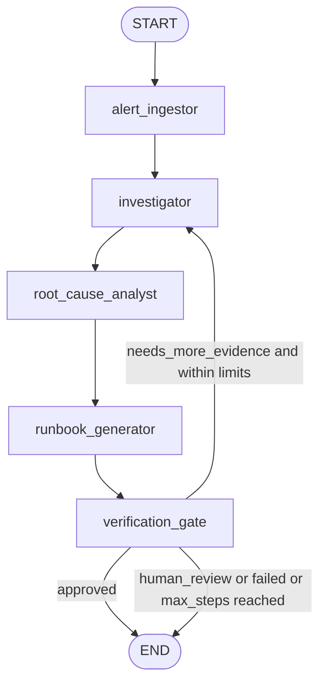

# InfraAgent State Graph

Research date: 2026-05-09, Europe/Minsk.

## Graph Overview
InfraAgent uses a five-node LangGraph workflow:

1. `alert_ingestor`
2. `investigator`
3. `root_cause_analyst`
4. `runbook_generator`
5. `verification_gate`

The graph is intentionally bounded. It can run the Investigator twice at most, and it ends with `ready`, `needs_human_review`, or `failed`. The final implementation is evidence-first: every run exposes runtime proof, evidence items, node traces, eval scorecard, and a War Room Packet.

## Mermaid Graph


## State Schema Detail
Use a state class extending LangGraph `MessagesState`.

### Core State
| Key | Example | Notes |
|---|---|---|
| `run_id` | `run_20260509_012500_checkout` | Created by API layer before graph start |
| `status` | `running` | Main polling status |
| `current_node` | `investigator` | Updated by each node |
| `messages` | LangGraph message list | Keep concise; use evidence objects for structured data |
| `ui_events` | list of event objects | Append-only events consumed by HF UI |

### Incident Context
```json
{
  "alert_id": "amd-demo-001",
  "scenario_id": "checkout_deploy_regression",
  "service": "checkout-api",
  "environment": "demo-prod",
  "severity": "critical",
  "title": "High 5xx rate and latency spike",
  "description": "5xx rate above 8 percent for 10 minutes after deploy.",
  "started_at": "2026-05-09T01:25:00+03:00",
  "time_window": {
    "from": "2026-05-09T01:10:00+03:00",
    "to": "2026-05-09T01:30:00+03:00"
  }
}
```

### Evidence State
```json
{
  "metrics": [
    {
      "evidence_id": "metric.5xx.001",
      "source": "fetch_prometheus_metrics_mock",
      "summary": "5xx rate rose from 0.4 percent to 8.7 percent after deploy.",
      "severity_hint": "critical"
    }
  ],
  "logs": [],
  "deploy_events": [],
  "traces": [],
  "topology": [],
  "runbook_templates": [],
  "tool_errors": []
}
```

### ReplayOps Proof State
```json
{
  "runtime_proof": {
    "backend_mode": "live_vllm",
    "model": "qwen2.5-72b-instruct",
    "runtime_stack": "ROCm + vLLM OpenAI-compatible API",
    "latency_ms": 42
  },
  "evidence_items": [],
  "node_traces": [],
  "eval_scorecard": {
    "score": 100,
    "max_score": 100,
    "grade": "pass"
  },
  "war_room_packet": "# War Room Packet - run_..."
}
```

### Hypotheses State
```json
[
  {
    "hypothesis_id": "h1",
    "summary": "Checkout deploy introduced database connection timeout regression.",
    "confidence": "high",
    "supporting_evidence_ids": ["deploy.001", "metric.5xx.001", "log.timeout.001"],
    "counter_evidence_ids": [],
    "next_evidence_needed": []
  }
]
```

### Root Cause State
```json
{
  "summary": "The checkout-api deploy introduced a database connection timeout regression.",
  "confidence": "high",
  "service": "checkout-api",
  "supporting_evidence_ids": ["deploy.001", "metric.5xx.001", "log.timeout.001", "trace.db.001"],
  "rejected_causes": [
    {
      "summary": "External payment provider outage",
      "reason": "Topology and traces show database latency dominates the failing path."
    }
  ],
  "gaps": []
}
```

### Runbook State
```json
{
  "title": "Rollback checkout-api and validate database latency",
  "impact": "Checkout requests are failing and slow for demo-prod users.",
  "immediate_actions": [
    "Freeze further checkout-api deploys.",
    "Rollback checkout-api to previous stable version."
  ],
  "validation_steps": [
    "Confirm 5xx rate below 1 percent.",
    "Confirm p95 latency returns near baseline."
  ],
  "rollback_plan": [
    "Restore the previous checkout-api image tag.",
    "Keep database pool settings unchanged until the service stabilizes."
  ],
  "communication_summary": "Likely deploy regression in checkout-api causing database timeouts.",
  "human_approval_required": true,
  "risk_notes": [
    "Do not apply remediation automatically in the hackathon demo."
  ]
}
```

### Control State
```json
{
  "step_count": 5,
  "max_steps": 7,
  "investigation_round": 1,
  "max_investigation_rounds": 2,
  "node_visits": {
    "alert_ingestor": 1,
    "investigator": 1,
    "root_cause_analyst": 1,
    "runbook_generator": 1,
    "verification_gate": 1
  },
  "approval": "approved",
  "missing_evidence_requests": []
}
```

## Edge Rules
### Static Edges
| From | To | Reason |
|---|---|---|
| `START` | `alert_ingestor` | Every run starts with alert normalization |
| `alert_ingestor` | `investigator` | Valid alerts need evidence collection |
| `investigator` | `root_cause_analyst` | Evidence is analyzed before a cause is selected |
| `root_cause_analyst` | `runbook_generator` | Recovery plan needs a candidate cause |
| `runbook_generator` | `verification_gate` | Final quality gate checks output |

### Conditional Edge From `verification_gate`
The gate returns one of three route labels:

| Route label | Destination | Condition |
|---|---|---|
| `approved` | `END` | Root cause cites evidence, runbook is complete, and loop limits are healthy |
| `needs_more_evidence` | `investigator` | Missing evidence is fixable and `investigation_round < 2` and `step_count < max_steps` |
| `human_review` | `END` | Low confidence, risky action, malformed state, or loop bound reached |
| `failed` | `END` | Unrecoverable validation or runtime error |

Implementation guidance:
- Use `add_conditional_edges("verification_gate", route_after_verification, mapping)` for this route.
- Do not also add a static edge from `verification_gate`; LangGraph docs warn that mixing static and dynamic routing from the same node can make behavior harder to reason about.

## Loop Protection
Required controls:
- Runtime config `recursion_limit = 8`.
- State field `control.max_steps = 7`.
- `control.max_investigation_rounds = 2`.
- `control.node_visits.investigator <= 2`.
- `control.node_visits.verification_gate <= 3`.
- If `RemainingSteps <= 2`, Verification Gate must return `human_review` with a partial runbook instead of continuing.

Loop protection outcomes:
- Normal finish: `status = ready`.
- Bounded partial finish: `status = needs_human_review`.
- Runtime failure: API catches the graph error, saves `status = failed`, and returns the latest state available to the UI.

## Node Contracts
### `alert_ingestor`
Input keys:
- `run_id`
- raw alert payload

Writes:
- `incident_context`
- `status`
- `current_node`
- `ui_events`
- `control`
- `audit`

Acceptance rule:
- Required alert fields are normalized and a scenario ID is available.

### `investigator`
Input keys:
- `incident_context`
- `control.missing_evidence_requests`

Writes:
- `evidence`
- `messages`
- `ui_events`
- `audit.tool_calls`
- `control.investigation_round`

Acceptance rule:
- At least two evidence groups are populated, unless tool errors explain why not.

### `root_cause_analyst`
Input keys:
- `incident_context`
- `evidence`

Writes:
- `hypotheses`
- `root_cause`
- `messages`
- `ui_events`

Acceptance rule:
- Root cause either cites supporting evidence IDs or explicitly states evidence gaps.

### `runbook_generator`
Input keys:
- `incident_context`
- `root_cause`
- `evidence`

Writes:
- `runbook`
- `messages`
- `ui_events`

Acceptance rule:
- Runbook includes immediate actions, validation steps, rollback plan, and human approval flag.

### `verification_gate`
Input keys:
- all state keys

Writes:
- `status`
- `control.approval`
- `control.missing_evidence_requests`
- final `ui_events`

Acceptance rule:
- The graph terminates or requests at most one more evidence round.

## Mock Tool Contracts
### `fetch_prometheus_metrics_mock`
Purpose: return time-series summaries for service health.

Input:
```json
{
  "scenario_id": "checkout_deploy_regression",
  "service": "checkout-api",
  "window_minutes": 20,
  "metric_names": ["http_5xx_rate", "p95_latency_ms", "cpu_utilization", "db_timeout_rate"]
}
```

Output:
```json
{
  "source": "fetch_prometheus_metrics_mock",
  "evidence": [
    {
      "evidence_id": "metric.5xx.001",
      "summary": "5xx rate rose from 0.4 percent to 8.7 percent after deploy.",
      "severity_hint": "critical"
    }
  ]
}
```

Mock data: `data/mock/metrics/{scenario_id}.json`.

### `query_elasticsearch_mock`
Purpose: return representative log patterns and counts.

Input:
```json
{
  "scenario_id": "checkout_deploy_regression",
  "service": "checkout-api",
  "filters": {
    "levels": ["ERROR", "WARN"],
    "contains": ["timeout", "connection", "5xx"]
  }
}
```

Mock data: `data/mock/logs/{scenario_id}.jsonl`.

### `fetch_deploy_events_mock`
Purpose: reveal deploys and config changes near the alert window.

Input:
```json
{
  "scenario_id": "checkout_deploy_regression",
  "service": "checkout-api",
  "environment": "demo-prod"
}
```

Mock data: `data/mock/deploy_events/{scenario_id}.json`.

### `query_trace_spans_mock`
Purpose: identify slow dependencies and failing spans.

Input:
```json
{
  "scenario_id": "checkout_deploy_regression",
  "service": "checkout-api",
  "window_minutes": 20
}
```

Mock data: `data/mock/traces/{scenario_id}.json`.

### `fetch_service_topology_mock`
Purpose: map service dependencies and blast radius.

Input:
```json
{
  "scenario_id": "checkout_deploy_regression",
  "service": "checkout-api",
  "environment": "demo-prod"
}
```

Mock data: `data/mock/topology/{scenario_id}.json`.

### `read_runbook_template_mock`
Purpose: provide service-specific recovery template sections.

Input:
```json
{
  "service": "checkout-api",
  "incident_type": "deploy_regression"
}
```

Mock data: `data/mock/runbooks/{service}.md`.

## Polling API State Mapping
FastAPI should expose run state through durable snapshots.

`POST /api/triage`:
- creates `run_id`
- stores initial state
- starts graph execution in background
- returns `run_id`, `status_url`, and `poll_after_ms`

`GET /api/status/{run_id}`:
- reads current state by `run_id`
- returns current status, active node, progress, new UI events since `cursor`, runtime proof, evidence items, node traces, eval scorecard, final root cause, runbook, and War Room Packet when available

No WebSocket or SSE is required. If later infrastructure supports streaming, it can be added as a separate optional surface after the polling path works.

## Demo Scenario Requirements
Minimum fixtures for a strong demo:
- `checkout_deploy_regression`: deploy causes 5xx, timeout logs, slow DB traces.
- `payments_dependency_slowdown`: downstream dependency latency, no deploy correlation.
- `inventory_cpu_saturation`: CPU and queue depth spike with scaling recommendation.

Each scenario should include:
- Metrics file.
- Logs file.
- Deploy events file.
- Trace spans file.
- Topology file.
- Runbook template file.

## Verification Checklist
- The graph has five nodes, within the task limit.
- The external API is polling-based.
- No node executes remediation directly.
- The Investigator uses typed tools and structured evidence.
- The Verification Gate enforces evidence quality and loop bounds.
- The system can show progress events in the UI without SSE or WebSocket.
